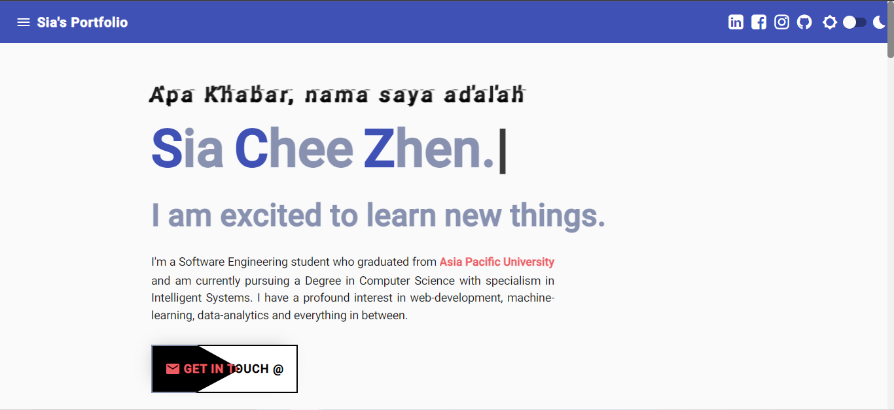

# Portfolio

This project was generated with [Angular CLI](https://github.com/angular/angular-cli) version 13.2.5. (Material References Refer Below)

(Access my Website here: https://heysia.dev)

## Development server

Run `ng serve` for a dev server. Navigate to `http://localhost:4200/`. The app will automatically reload if you change any of the source files.

## Code scaffolding

Run `ng generate component component-name` to generate a new component. You can also use `ng generate directive|pipe|service|class|guard|interface|enum|module`.

## Build

Run `ng build` to build the project. The build artifacts will be stored in the `dist/` directory.

## Running unit tests

Run `ng test` to execute the unit tests via [Karma](https://karma-runner.github.io).

## Running end-to-end tests

Run `ng e2e` to execute the end-to-end tests via a platform of your choice. To use this command, you need to first add a package that implements end-to-end testing capabilities.

## Further help

To get more help on the Angular CLI use `ng help` or go check out the [Angular CLI Overview and Command Reference](https://angular.io/cli) page.

## Material References
1. https://stackoverflow.com/questions/54468705/set-interval-on-an-array-in-angular-project (Guerric P)
2. https://stackoverflow.com/questions/36101756/angular2-routing-with-hashtag-to-page-anchor (cheese)
3. https://stackoverflow.com/questions/49820013/javascript-scrollintoview-smooth-scroll-and-offset (Søren D. Ptæus & Raphaël Balet)
4. https://stackoverflow.com/questions/55777845/how-do-i-check-if-the-user-has-scrolled-down-or-crossed-to-a-particular-eleme (j3ff)
5. https://codepen.io/chalupagrande/pen/zBaqdR
6. https://codepen.io/cgatno/pen/GxJvxg
7. https://codepen.io/raubaca/pen/rxLwPq
8. https://stackblitz.com/edit/ngx-hide-on-scroll?file=src%2Fapp%2Fapp.component.html
9. https://www.w3schools.com/howto/howto_css_flip_card.asp
10. https://digitalsynopsis.com/design/beautiful-color-ui-gradients-backgrounds/
11. https://material.io/resources/color/#!/?view.left=1&view.right=0&primary.color=212121
12. https://techforluddites.com/replacing-list-bullets-with-images-using-css/
13. https://css-tricks.com/css-link-hover-effects/
14. https://mycolor.space/
15. https://lenadesign.org/2021/05/18/css-bouncing-text-animation/
16. https://www.youtube.com/watch?v=GvgpzcGcRbQ&ab_channel=KieranVenison
17. https://www.youtube.com/watch?v=HCYteRRGcCM&ab_channel=BaljeetSingh
18. https://github.com/Prem-minister/helloprem

