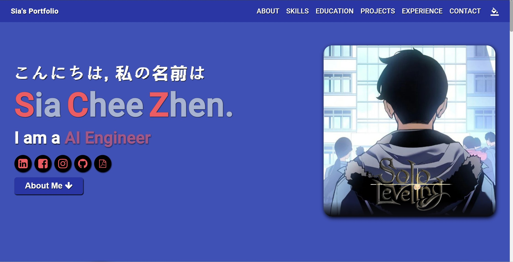

# Portfolio

<h2 align ="center"><a href="https://heysia.dev" target="_blank">Click Here to Access my Website</a></h2>
This project was generated with [Angular CLI](https://github.com/angular/angular-cli) version 13.2.5, but is upgraded to latest version 17.2.3. (Material References Refer Below)

## Development server
Run `ng serve` for a dev server. Navigate to `http://localhost:4200/`. The app will automatically reload if you change any of the source files.

## Code scaffolding
Run `ng generate component component-name` to generate a new component. You can also use `ng generate directive|pipe|service|class|guard|interface|enum|module`.

## Build
Run `ng build` to build the project. The build artifacts will be stored in the `dist/` directory.

## Running unit tests
Run `ng test` to execute the unit tests via [Karma](https://karma-runner.github.io).

## Running end-to-end tests
Run `ng e2e` to execute the end-to-end tests via a platform of your choice. To use this command, you need to first add a package that implements end-to-end testing capabilities.

## Further help
To get more help on the Angular CLI use `ng help` or go check out the [Angular CLI Overview and Command Reference](https://angular.io/cli) page.

## Material References & Picture References
1. https://stackoverflow.com/questions/54468705/set-interval-on-an-array-in-angular-project (Guerric P)
2. https://stackoverflow.com/questions/36101756/angular2-routing-with-hashtag-to-page-anchor (cheese)
3. https://stackoverflow.com/questions/49820013/javascript-scrollintoview-smooth-scroll-and-offset (Søren D. Ptæus & Raphaël Balet)
4. https://stackoverflow.com/questions/55777845/how-do-i-check-if-the-user-has-scrolled-down-or-crossed-to-a-particular-eleme (j3ff)
5. https://codepen.io/chalupagrande/pen/zBaqdR
6. https://codepen.io/cgatno/pen/GxJvxg
7. https://codepen.io/raubaca/pen/rxLwPq
8. https://github.com/Prem-minister/helloprem
9. https://stackblitz.com/edit/ngx-hide-on-scroll?file=src%2Fapp%2Fapp.component.html
10. https://www.w3schools.com/howto/howto_css_flip_card.asp
11. https://digitalsynopsis.com/design/beautiful-color-ui-gradients-backgrounds/
12. https://material.io/resources/color/#!/?view.left=1&view.right=0&primary.color=212121
13. https://techforluddites.com/replacing-list-bullets-with-images-using-css/
14. https://css-tricks.com/css-link-hover-effects/
15. https://mycolor.space/
16. https://lenadesign.org/2021/05/18/css-bouncing-text-animation/
17. https://www.youtube.com/watch?v=GvgpzcGcRbQ&ab_channel=KieranVenison
18. https://www.youtube.com/watch?v=HCYteRRGcCM&ab_channel=BaljeetSingh
19. https://css-tricks.com/snippets/css/typewriter-effect/
20. https://www.npmjs.com/package/vanilla-tilt
21. https://stackoverflow.com/questions/7415872/change-color-of-png-image-via-css
22. https://stackoverflow.com/questions/40242378/underline-from-left-to-right-on-hover-in-and-out
23. https://www.crunchyroll.com/anime-news/2022/09/16/bocchi-the-rock-character-trailer-introduces-lead-girl-hitori-goto
24. https://knowyourmeme.com/memes/hitori-goto-bocchi
25. https://www.icegif.com/bocchi-the-rock-4/
26. https://www.youtube.com/watch?v=31HfP81oWDI&ab_channel=EonIsBuffering...
27. https://www.wallpaperflare.com/code-colorful-lights-wallpaper-cuhwc
28. https://codepen.io/RaduBratan/pen/dyGEzay
29. https://codepen.io/aybukeceylan/pen/RwrRPoO
30. https://theotakuplanet.wordpress.com/2018/11/29/me/
31. https://tenor.com/view/revive-me-jett-spray-jett-valorant-confused-trying-to-think-gif-26097763
32. https://www.fusionexus.com/offical/
33. https://www.crunchyroll.com/anime-feature/2023/01/04/feature-bocchi-the-rock-is-a-great-exploration-of-anxiety-and-finding-freedom-through-art
34. https://dev.to/codesphere/should-you-really-be-coding-in-dark-mode-4ng8
35. https://www.springboard.com/blog/software-engineering/coding-project-ideas/
36. https://mailthis.to/
37. https://medium.com/@babatundelamidi/build-an-angular-contact-form-and-post-data-to-email-7b7327e56ad3
38. https://www.crunchyroll.com/anime-news/2022/09/16/bocchi-the-rock-character-trailer-introduces-lead-girl-hitori-goto
39. https://knowyourmeme.com/memes/hitori-goto-bocchi
40. https://www.icegif.com/bocchi-the-rock-4/
41. https://www.youtube.com/watch?v=31HfP81oWDI&ab_channel=EonIsBuffering...
42. https://www.wallpaperflare.com/code-colorful-lights-wallpaper-cuhwc
43. https://codepen.io/RaduBratan/pen/dyGEzay
44. https://codepen.io/aybukeceylan/pen/RwrRPoO
45. https://theotakuplanet.wordpress.com/2018/11/29/me/
46. https://tenor.com/view/revive-me-jett-spray-jett-valorant-confused-trying-to-think-gif-26097763
47. https://www.fusionexus.com/offical/
48. https://www.crunchyroll.com/anime-feature/2023/01/04/feature-bocchi-the-rock-is-a-great-exploration-of-anxiety-and-finding-freedom-through-art
49. https://dev.to/codesphere/should-you-really-be-coding-in-dark-mode-4ng8
50. https://www.springboard.com/blog/software-engineering/coding-project-ideas/
51. https://mailthis.to/
52. https://medium.com/@babatundelamidi/build-an-angular-contact-form-and-post-data-to-email-7b7327e56ad3
53. https://www.crunchyroll.com/anime-news/2022/09/16/bocchi-the-rock-character-trailer-introduces-lead-girl-hitori-goto
54. https://knowyourmeme.com/memes/hitori-goto-bocchi
55. https://www.icegif.com/bocchi-the-rock-4/
56. https://www.youtube.com/watch?v=31HfP81oWDI&ab_channel=EonIsBuffering...
57. https://www.wallpaperflare.com/code-colorful-lights-wallpaper-cuhwc
58. https://codepen.io/RaduBratan/pen/dyGEzay
59. https://codepen.io/aybukeceylan/pen/RwrRPoO
60. https://theotakuplanet.wordpress.com/2018/11/29/me/
61. https://tenor.com/view/revive-me-jett-spray-jett-valorant-confused-trying-to-think-gif-26097763
62. https://www.fusionexus.com/offical/
63. https://www.crunchyroll.com/anime-feature/2023/01/04/feature-bocchi-the-rock-is-a-great-exploration-of-anxiety-and-finding-freedom-through-art
64. https://dev.to/codesphere/should-you-really-be-coding-in-dark-mode-4ng8
65. https://www.springboard.com/blog/software-engineering/coding-project-ideas/
66. https://mailthis.to/
67. https://medium.com/@babatundelamidi/build-an-angular-contact-form-and-post-data-to-email-7b7327e56ad3
